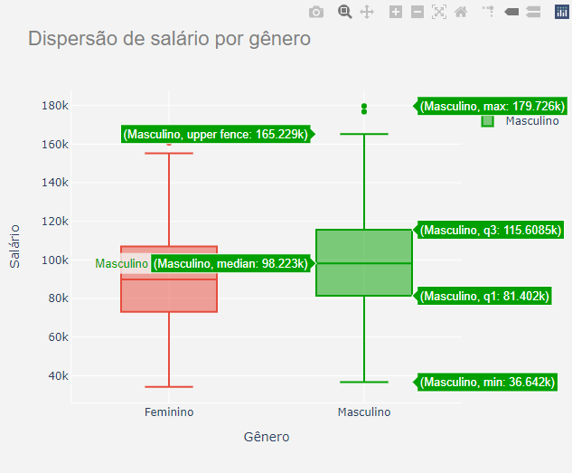

# Desafio Técnico

Caso o notebook não abra, acesse pelo Google Colab https://colab.research.google.com/drive/1gUTKsqOviq-ZbQyInguDpgYlQQaxmfdH?usp=sharing
 
Basta ir em "Ambiente de execução" e depois "Executar tudo", você pode realizar edições nas entradas a vontade :D

# Desafio - Análise de dados 😊

## Quais são os passos iniciais para uma análise de dados eficiente?

Para qualquer análise que formos fazer, é essencial que esteja bem definido o objetivo dessa análise para você não se perder nos dados.
A segunda parte, que também é fundamental, é a limpeza e organização dos dados, pois nem sempre os dados coletados estão organizados *(em geral, não vão estar rsrs)*. É **SEMPRE** importante saber a origem dos seus dados, como eles foram coletados, e se a metodologia utilizada irá enviesar sua análise.

Sabendo qual problema você quer entender e com os dados organizados, basta explorar e criar visualizações para ajudar no seu entendimento e no das outras pessoas que irão precisar desses dados.

### Dado o cenário abaixo, escreva um algoritmo (passo a passo em alto nível) que descreve o processo que você colocaria em prática. 

> Um supermercado gostaria de recomendar produtos aos seus clientes de acordo com suas compras passadas. É possível, por exemplo, prever situações como a saúde do cliente (compras de mais remédios), se o cliente tem um pet (compras de produtos veterinários), mudança de casa (compras de móveis), entre outras situações. Além disso, o sistema deve tentar entender quando uma compra passada não agradou o usuário e evitar continuar recomendando produtos como aquele. Assumindo que você tem acesso ao banco de dados e há informações o suficiente, qual seria o passo a passo (etapas em alto nível) para fazer um tipo de análise como essa?

Para esse case, precisamos segmentar nossos clientes e saber em que grupo eles se encaixam para conseguirmos recomendar algo.

Para fazer isso, todo o processo de organização e limpeza dos dados a fim de conhecê-los. Também iria conferir se eu teria os dados que preciso para fazer essa segmentação, faria a análise de quais seriam nossas entradas no algoritmo e com isso definido, podemos começar a segmentar nossos clientes.

No case acima, eu usaria um algoritmo de clusterização para definir grupos de clientes. Assim como recomendar o que outros clientes daquele mesmo grupo estão comprando.
No caso de uma compra que não foi boa, precisamos de uma forma do cliente responder se aquela compra foi boa ou não, e se fosse possível, o motivo pelo qual não foi boa. Tendo isso, conseguiríamos decidir se aquele produto em especifico não foi bom ou se é aquele tipo de produto que não é bom para o cliente. A depender, podemos recomendar outros produtos do mesmo tipo, e em outros casos podemos simplesmente não recomendar mais produtos igual a este.

## Quais são os passos essenciais para pré processar os dados antes de aplicar algoritmos de Machine Learning?

Os passos incluem uma boa analise de dados e mais algumas coisas. Precisamos definir quais serão as entradas do nosso algoritmo, para isso, precisamos entender como essas entradas se relacionam com a saída, se existem correlações (positivas e negativas), e também temos uma etapa muito importante que é decidir quais serão os dados de treino.

Além disso, enfatizo bastante a questão de saber a origem dos dados, pois temos muitos problemas de algoritmos enviesados, então é muito importante entender quais são os vieses dos seus dados e como evitar que seu algoritmo seja enviesado no treinamento.

## O que são outliers/anomalias?

Outliers são pontos na amostra que não explicam a população. 

Vamos usar de exemplo o desafio acima, estamos tentando entender o comportamento dos nossos clientes, então estamos fazendo uma segmentação baseado nas compras. 

Um belo dia, um cliente que tinha o perfil de não consumir álcool, foi ao supermercado e comprou 3 caixas de cerveja e 1 garrada de Whisky.

Bom, é um comportamento suspeito, já que é a primeira vez que isso acontece em um intervalo grande de tempo. Podemos nos perguntar: Foi realmente esse cliente que fez a compra ou alguém comprou com o cadastro dele? É uma festa que nosso cliente ficou encarregado de comprar as bebidas, mesmo não bebendo? Ou ele agora começou a beber? Coisas que só saberíamos se continuássemos a observar o comportamento. *Coisas que só saberíamos se continuássemos a observar o comportamento*

Percebam que esse comportamento não explica o comportamento usual do cliente, que é não comprar bebidas alcoólicas, logo, pode ser considerado um outlier.

### Como detectar os outliers ?

Antes de qualquer coisa, precisamos entender o que são boxplots. 

Os gráficos boxplots mostram como está a distribuição dos nossos dados, inclusive onde está a média. 

Recentemente, eu fiz uma análise que sobre diferença salarial entre homens e mulheres, e o gráfico abaixo é um boxplot dessa análise. O gráfico é dividido em quartis, cada quartil representa 25% dos dados, e existe uma divisão dos dados abaixo da média e acima da média. 

Olhando para esse gráfico apenas, podemos considerar que outliers são os pontos que estão fora dos quartis, em geral pontos que se distanciam muito da média.  

Nesse caso vemos a média como 98.223k ao ano, enquanto que o maior salário é de 179,726K.

É uma grande diferença, porém temos que analisar outros fatores (qual a profissão dessa pessoa, realizar um boxplot só dessa profissão, onde essa pessoa mora etc) para determinar se é ou não um outlier.

Agora que sabemos sobre o boxplot, conseguimos pensar em retirar eles da amostra *(com sabedoria rsrs).*

## Descreva em alto nível um (qualquer) algoritmo de Machine Learning que você tenha conhecimento.

Vamos de regressão linear,

O algoritmo de regressão linear é um algoritmo supervisionado que se baseia na correlação entre X e Y, por exemplo, queremos prever quanto alguém gasta com refrigerantes. Analisando os dados, identificamos uma correlação com a variável "Gastos com pizza", dado isso, meu X é igual a "Gastos com pizza" e Y é igual a "Gastos com refrigerante".

*Obs: é muito importante ficar atento sobre as escolhas de variáveis por que nem sempre essa relação é de causa e efeito.*

O que o algoritmo vai fazer, é traçar uma linha que mais se encaixa no meu eixo X e Y, achando um coeficiente de angulação da reta, calculando os desvios e dando sempre preferência a menores desvios.

Temos algumas métricas para medir a acurácia do modelo, que penalizam levando em consideração os desvios da reta, e com isso conseguimos medir se nosso modelo está muito ruim, bom, com overfitting, etc.

### Considerações finais 😌

Aprendi demais com esse teste, tive que revisitar alguns conceitos, pesquisar, achar melhores maneiras de me expressar, e no final das contas nenhum tempo estudando é tempo perdido.

O caminho é longo, tenho muito que aprender, e estou ciente do quão longo é o caminho rsrs.

Obrigada a você que leu até aqui! :D
